# xml-doc-flow

## Описание сервиса
Сервис на Spring Boot для загрузки, определения типа и валидации строительных XML-документов по XSD (Минстрой РФ) с сохранением в PostgreSQL.

При старте приложения Hibernate создаёт минимальные таблицы, а содержимое XSD из `services/app/src/main/resources/validation-files/**.xsd` загружается в справочную таблицу `xsd_definitions`.

Если в `spring.datasource.url` указана БД PostgreSQL, которой ещё нет (например `xml_doc_flow`), приложение **до подключения Hibernate** подключается к служебной БД `postgres` и выполняет `CREATE DATABASE`, если база отсутствует. Нужны права на создание БД у пользователя из `spring.datasource.username` (**при локальном запуске приложения**).

Часовой пояс для `LocalDateTime` и Jackson задаётся в `application.yml`: `app.time-zone` (по умолчанию `Europe/Moscow`). Переопределить можно тем же ключом через внешний конфиг, JVM-свойство `-Dapp.time-zone=UTC` или переменные Spring Boot для соответствующего свойства.

## Требования к реализации:

### 🔹 1. Загрузка и валидация

- ✅ Реализовать загрузку XML-файла установленного формата через веб-интерфейс.
- ✅ Проверять файл на соответствие XSD-схемам Минстроя России (используя стандартные Java-библиотеки).
- ✅ Отображать пользователю результат проверки:
    - ✅ «валидный документ»
    - ✅ «ошибка валидации» с текстовым описанием проблемы.

### 🔹 2. Парсинг и сохранение данных

- ✅ Извлекать ключевые поля: номер документа, дата, объект строительства, участники.
- ✅ Сохранять извлечённые данные в базу данных PostgreSQL.
- ✅ Сохранять оригинальный XML-файл и прикреплять его к карточке записи с возможностью скачивания.

### 🔹 3. Интерфейс и ролевой доступ

- ✅ Отображать список загруженных документов.
- ✅ Реализовать карточку детального просмотра документа.
- ✅ Обеспечить ролевую видимость: документы доступны Подрядчику, загрузившему их, и Сотрудникам Заказчика, имеющим доступ к соответствующему объекту строительства.

### 🔹 4. Версионность

- ✅ При повторной загрузке документа с тем же номером создавать новую версию.
- ✅ Отображать историю версий документа.

### 🔹 5. Аудит-лог

- ✅ Фиксировать действия пользователей: загрузка, изменение, просмотр. *(загрузка и замена версии, просмотр карточки, скачивание XML; отдельная запись при открытии только списка документов не пишется.)*
- ✅ Сохранять дату/время, пользователя и тип события.

### 🔹 6. Технический стек

- ✅ Backend: Java или Kotlin (рекомендуется Spring Boot).
- ✅ БД: PostgreSQL.
- ✅ Парсинг XML: JAXB / Jackson XML. *(в проекте: DOM + XPath для извлечения полей, `javax.xml.validation` для XSD; JAXB/Jackson XML не используются — функционально эквивалентно задаче.)*
- ✅ Frontend: любой, главное — работоспособность.

### 🔹 7. Поддержка перечня документов

- ✅ Корректная работа со всеми 21 типом из «Минимального перечня» (9 актов исполнительной документации, 4 журнала, 8 документов строительного контроля) по официальным XSD-схемам, опубликованным на сайте Минстроя.

### 🔹 8. Артефакты для сдачи проекта («Образ результата»)

- ✅ Репозиторий с исходным кодом.
- ✅ Инструкция по запуску.
- ✅ Публичный URL для тестирования или готовый docker-compose. *(в `docker-compose.yml`: БД, Spring Boot, **nginx с фронтендом** и прокси `/api` → backend; единая точка входа `http://localhost:8888`. Публичный URL при деплое — свой домен за тем же reverse-proxy.)*
- ✅ Краткая презентация архитектуры решения. *(описание сервиса, API, ER-диаграмма в этом README.)*

## Демо-стенд

Публичный адрес: **http://xml-doc-flow.duckdns.org:8888**

### Демо-учётные записи

- **Демо-подрядчик**
  - Логин: `contractor`
  - Пароль: `artwell-local-2026!`
  - Роль: `CONTRACTOR` — загружает документы, видит только свои

- **Демо-заказчик**
  - Логин: `customer`
  - Пароль: `artwell-local-2026!`
  - Роль: `CUSTOMER` — просматривает документы по объектам строительства

> Доступ под учётной записью **администратора** предоставляется по запросу.
> Администратор может управлять пользователями, менять роли и пароли.

---

## Запуск

Требуется только **Docker Desktop** — Java и Maven устанавливать не нужно, сборка происходит внутри контейнера.

### Структура репозитория

```
xml-doc-flow/                  ← корень репозитория (README и docker-compose.yml здесь)
├── xml-doc-flow-backend/      ← бэкенд
└── xml-doc-flow-frontend/     ← фронтенд
```

### Шаги

1. Клонировать репозиторий:
   ```bash
   git clone https://github.com/marussiakuz/xml-doc-flow.git
   cd xml-doc-flow
   ```

2. Собрать и запустить стек (PostgreSQL + backend + **веб-интерфейс за nginx**):
   ```bash
   docker compose up --build
   ```

3. Открыть **веб-интерфейс** (рекомендуемая точка входа):
   - http://localhost:8888/

4. Swagger UI (напрямую к Spring Boot):
   - http://localhost:8080/swagger-ui.html

5. OpenAPI JSON:
   - http://localhost:8080/v3/api-docs

Сервис `web` (nginx) отдаёт статику из `xml-doc-flow-frontend` и проксирует `/api` на контейнер `app`. Во фронтенде `js/api.js` базовый URL по умолчанию — относительный `/api`, поэтому сценарий работает и при деплое за reverse-proxy на любом хосте без правки кода.

## Пользователи при первом запуске (seed)

При старте приложения выполняется `ReferenceDataInitializer`, который создаёт тестовую организацию и пользователей, если их ещё нет.

### Создаваемые пользователи
- **Администратор (логин настраивается)**
   - Логин: `${APP_SEED_TEST_USERNAME}` (по умолчанию `test`)
   - Пароль: `${APP_SEED_TEST_PASSWORD}` (по умолчанию `test`)
   - Роль: `ADMIN`

- **Демо-подрядчик**
   - Логин: `contractor`
   - Пароль: `${APP_SEED_DEMO_PASSWORD}` (по умолчанию `artwell-local-2026!`)
   - Роль: `CONTRACTOR`

- **Демо-заказчик**
   - Логин: `customer`
   - Пароль: `${APP_SEED_DEMO_PASSWORD}` (по умолчанию `artwell-local-2026!`)
   - Роль: `CUSTOMER`

> Примечание: если в базе уже есть `contractor/customer`, инициализатор автоматически заменит его пароль на `${APP_SEED_DEMO_PASSWORD}`.

### Как зайти (UI логинит автоматически, для API-вызовов (без UI) при локальном запуске через IDE или контейнеризованном локальном запуске)
1. Выполнить `POST /api/auth/login` с JSON:
   - `{"username":"test","password":"test"}` (или ваши значения `APP_SEED_TEST_*`)
   - `{"username":"contractor","password":"artwell-local-2026!"}` (или `APP_SEED_DEMO_PASSWORD`)
   - `{"username":"customer","password":"artwell-local-2026!"}` (или `APP_SEED_DEMO_PASSWORD`)
2. Дальше сессия хранится в cookie (используется HTTP session).

## API (MVP)

Полный и всегда актуальный список эндпоинтов доступен в Swagger UI:
- http://localhost:8080/swagger-ui.html

OpenAPI JSON:
- http://localhost:8080/v3/api-docs

Ниже — краткий список основных эндпоинтов (по контроллерам).

### Документы (`/api/documents`)
- `POST /api/documents` — загрузка XML (multipart), определение типа по корню, XSD‑валидация, сохранение
- `POST /api/documents/search` — поиск документов с фильтрацией и пагинацией (JSON)
- `GET /api/documents/{id}` — карточка документа (объект, участники, версии, кто загрузил)
- `GET /api/documents/{documentId}/versions` — список версий документа
- `GET /api/documents/{documentId}/versions/latest/download` — скачать XML последней версии документа
- `GET /api/documents/{documentId}/versions/{versionId}/download` — скачать XML конкретной версии документа
- `GET /api/documents/{id}/xml` — скачать исходный XML по id версии
- `GET /api/documents/{documentId}/history` — история событий аудита по документу
- `PUT /api/documents/{id}/replace` — замена XML: новая версия при совпадении типа и номера документа

### Аутентификация (`/api/auth`)
- `POST /api/auth/login` — логин
- `POST /api/auth/logout` — логаут
- `GET /api/auth/me` — текущий пользователь

### Администрирование пользователей (`/api/admin/users`, только ADMIN)
- `GET /api/admin/users` — список пользователей (фильтр по роли + пагинация)
- `GET /api/admin/users/{id}` — получить пользователя по ID
- `POST /api/admin/users` — создать пользователя
- `PUT /api/admin/users/{id}` — обновить пользователя
- `DELETE /api/admin/users/{id}` — удалить пользователя (мягкое удаление)
- `POST /api/admin/users/{id}/reset-password` — сброс пароля

### Журнал аудита (`/api/audit-log`, только ADMIN)
- `GET /api/audit-log` — глобальный журнал действий (пагинация)

## Схема базы данных (детальная)

### Описание таблиц

| Таблица | Назначение |
|---------|------------|
| `organizations` | Справочник организаций (юридических лиц) — застройщики, подрядчики, проектировщики, стройконтроль |
| `users` | Пользователи системы с ролевой моделью (7 ролей: ADMIN, CUSTOMER, TECH_CUSTOMER, CONTRACTOR, SUB_CONTRACTOR, DESIGNER, SUPERVISOR) |
| `construction_objects` | Объекты капитального строительства (здания, сооружения) с привязкой к участникам проекта |
| `document_types` | Справочник типов документов (21 тип по классификации Минстроя России) |
| `documents` | Основная таблица документов — хранит метаданные (номер, дата, тип, объект) |
| `document_versions` | Версии документов — хранит оригинальные XML-файлы и статусы валидации |
| `document_participants` | Участники документов (застройщик, подрядчик, проектировщик и др.) с реквизитами |
| `work_volumes` | Объемы и суммы работ по документам (для агрегации и отчетов) |
| `role_document_permissions` | Права ролей к типам документов (`can_upload`, `can_view`); в коде для проверок используется `can_upload` |
| `user_object_access` | Права доступа пользователей к объектам строительства (разграничение по объектам) |
| `role_assignment_history` | История назначения ролей пользователям (аудит изменений ролей) |
| `audit_log` | Журнал аудита всех действий пользователей (загрузка, просмотр, скачивание, удаление) |

---

### ER-диаграмма

```mermaid
erDiagram
    organizations {
        bigserial id PK "уникальный идентификатор организации"
        varchar org_name "полное наименование организации"
        varchar org_short_name "краткое наименование"
        varchar org_type "тип: CUSTOMER/CONTRACTOR/DESIGNER/SUPERVISOR"
        varchar inn UK "ИНН организации"
        varchar kpp "КПП организации"
        text legal_address "юридический адрес"
        boolean is_active "активна / заблокирована"
    }

    users {
        bigserial id PK "уникальный идентификатор пользователя"
        varchar username UK "логин для входа"
        varchar password_hash "хеш пароля (BCrypt)"
        varchar full_name "ФИО пользователя"
        varchar role "основная роль: ADMIN/CUSTOMER/TECH_CUSTOMER/CONTRACTOR/SUB_CONTRACTOR/DESIGNER/SUPERVISOR"
        varchar[] additional_roles "дополнительные роли (массив)"
        bigint organization_id FK "ссылка на организацию (работодателя)"
        varchar email "email для уведомлений"
        boolean is_active "активен / заблокирован"
        timestamp last_login "дата и время последнего входа"
    }

    construction_objects {
        bigserial id PK "уникальный идентификатор объекта"
        varchar object_code UK "уникальный код объекта (для интеграции)"
        varchar object_name "наименование объекта строительства"
        text address "адрес объекта"
        bigint customer_id FK "заказчик (ссылка на пользователя)"
        bigint contractor_id FK "генеральный подрядчик"
        bigint designer_id FK "проектировщик"
        bigint supervisor_id FK "строительный контроль"
        varchar status "статус: active/suspended/completed/archived"
        date start_date "дата начала строительства"
        date end_date "плановая дата окончания"
    }

    document_types {
        bigserial id PK "уникальный идентификатор типа документа"
        varchar type_code UK "код типа документа (по классификации Минстроя)"
        varchar type_name "наименование типа документа"
        varchar category "категория: Исполнительная документация/Журналы/Строительный контроль"
        varchar xsd_schema_path "путь к XSD-схеме для валидации"
        boolean is_active "тип активен / отключен"
    }

    documents {
        bigserial id PK "уникальный идентификатор документа"
        varchar document_number "номер документа (из XML)"
        date document_date "дата документа (из XML)"
        bigint document_type_id FK "тип документа (ссылка на справочник)"
        bigint construction_object_id FK "объект строительства"
        varchar title "название документа"
        integer current_version "текущий номер версии"
        boolean is_latest_version "признак последней версии"
        bigint uploaded_by FK "кто загрузил документ"
        timestamp uploaded_at "дата и время загрузки"
        varchar status "статус: active/archived/replaced/deleted"
    }

    document_versions {
        bigserial id PK "уникальный идентификатор версии"
        bigint document_id FK "ссылка на документ"
        integer version_number "номер версии (начиная с 1)"
        varchar xml_file_path "путь к сохраненному XML-файлу"
        varchar xml_file_name "оригинальное имя файла"
        bigint xml_file_size "размер файла в байтах"
        varchar validation_status "статус валидации: pending/validating/valid/invalid/error"
        text validation_errors "текст ошибок валидации (если есть)"
        bigint uploaded_by FK "кто загрузил версию"
        timestamp uploaded_at "дата и время загрузки версии"
        bigint previous_version_id FK "ссылка на предыдущую версию (для цепочки)"
    }

    document_participants {
        bigserial id PK "уникальный идентификатор участника"
        bigint document_version_id FK "ссылка на версию документа"
        varchar participant_role "роль: Застройщик/Подрядчик/Проектировщик и т.д."
        varchar participant_type "тип: legal/physical/organization"
        varchar participant_name "наименование организации или ФИО"
        varchar participant_inn "ИНН (для юридических лиц)"
        varchar participant_kpp "КПП (для юридических лиц)"
    }

    work_volumes {
        bigserial id PK "уникальный идентификатор объема работ"
        bigint document_version_id FK "ссылка на версию документа"
        varchar work_type "тип работ (код или наименование)"
        decimal quantity "объем работ (в единицах измерения)"
        decimal price "цена за единицу"
        decimal amount "общая сумма (quantity * price)"
    }

    role_document_permissions {
        bigserial id PK "уникальный идентификатор права"
        varchar role "роль пользователя"
        bigint document_type_id FK "тип документа"
        boolean can_upload "может загружать документы этого типа"
        boolean can_view "флаг в справочнике (просмотр документов в PermissionService не читает колонку)"
    }

    user_object_access {
        bigserial id PK "уникальный идентификатор доступа"
        bigint user_id FK "пользователь"
        bigint construction_object_id FK "объект строительства"
        varchar access_level "уровень доступа: read/write/admin"
    }

    role_assignment_history {
        bigserial id PK "уникальный идентификатор записи истории"
        bigint user_id FK "пользователь, чья роль изменилась"
        varchar old_role "старая роль"
        varchar new_role "новая роль"
        bigint changed_by FK "кто изменил роль (администратор)"
        timestamp changed_at "дата и время изменения"
    }

    audit_log {
        bigserial id PK "уникальный идентификатор записи аудита"
        bigint user_id FK "пользователь, совершивший действие"
        varchar username "логин пользователя (для быстрого поиска)"
        varchar action_type "тип действия: UPLOAD/VIEW/DOWNLOAD/UPDATE/DELETE/LOGIN/ROLE_CHANGE"
        varchar entity_type "тип сущности: DOCUMENT/VERSION/USER/OBJECT"
        bigint entity_id "ID сущности, с которой произведено действие"
        jsonb action_details "детали действия в формате JSON"
        inet ip_address "IP-адрес пользователя"
        timestamp created_at "дата и время действия"
    }

    %% ==================== СВЯЗИ ====================
    organizations ||--o{ users : "имеет сотрудников"
    users ||--o{ documents : "загружает"
    users ||--o{ document_versions : "загружает версию"
    users ||--o{ audit_log : "совершает действия"
    users ||--o{ user_object_access : "имеет доступ к"
    users ||--o{ role_assignment_history : "имеет историю ролей"
    
    construction_objects ||--o{ documents : "содержит"
    construction_objects ||--o{ user_object_access : "доступны для"
    
    document_types ||--o{ documents : "определяет тип"
    document_types ||--o{ role_document_permissions : "настраивает права"
    
    documents ||--|{ document_versions : "имеет версии"
    
    document_versions ||--o{ document_participants : "включает участников"
    document_versions ||--o{ work_volumes : "содержит объемы"
    document_versions ||--o| document_versions : "ссылается на предыдущую версию"
```


