# xml-doc-flow

## Что это
Сервис на Spring Boot для загрузки, определения типа и валидации строительных XML-документов по XSD (Минстрой РФ) с сохранением в PostgreSQL.

При старте приложения Hibernate создаёт минимальные таблицы, а содержимое XSD из `services/app/src/main/resources/validation-files/**.xsd` загружается в справочную таблицу `xsd_definitions`.

Если в `spring.datasource.url` указана БД PostgreSQL, которой ещё нет (например `xml_doc_flow`), приложение **до подключения Hibernate** подключается к служебной БД `postgres` и выполняет `CREATE DATABASE`, если база отсутствует. Нужны права на создание БД у пользователя из `spring.datasource.username` (в Docker-образе `postgres` это обычно так).

Часовой пояс для `LocalDateTime` и Jackson задаётся в `application.yml`: `app.time-zone` (по умолчанию `Europe/Moscow`). Переопределить можно тем же ключом через внешний конфиг, JVM-свойство `-Dapp.time-zone=UTC` или переменные Spring Boot для соответствующего свойства.

## Запуск
Требуется Docker Desktop.

1. Запуск стека:
   ```bash
   docker compose up --build
   ```
2. Swagger UI:
   - http://localhost:8080/swagger-ui.html
3. OpenAPI JSON:
   - http://localhost:8080/v3/api-docs

## API (5 эндпоинтов MVP)
Базовый URL: `/api/documents`

В загрузку нужно передавать **XML-документ** (экземпляр по схеме Минстроя: корень вида `aogrooks` в своём namespace и т.п.). Файлы **`.xsl` / `.xsd` / `.svg`** из `validation-files` — это шаблоны отображения и схемы, они **не являются** документом для валидации и будут отклонены с понятным сообщением.

1. Загрузка XML и валидация (с сохранением при успехе)
   ```bash
   curl -i -X POST "http://localhost:8080/api/documents" \
     -F "file=@/path/to/document.xml"
   ```

2. Список документов (актуальная версия по каждому документу)
   ```bash
   curl -i "http://localhost:8080/api/documents?docType=AOGROOKS&documentNumber=123"
   ```

3. Детальный просмотр документа по `id` (все версии)
   ```bash
   curl -i "http://localhost:8080/api/documents/<id>"
   ```

4. Скачивание XML по `id`
   ```bash
   curl -i -OJ "http://localhost:8080/api/documents/<id>/xml"
   ```

5. Замена XML с версионированием
   ```bash
   curl -i -X PUT "http://localhost:8080/api/documents/<id>/replace" \
     -F "file=@/path/to/document.xml"
   ```

## Схема базы данных (детальная)

```mermaid
erDiagram
    organizations {
        bigserial id PK
        varchar org_name "название организации"
        varchar org_short_name "краткое название"
        varchar org_type "тип: CUSTOMER/CONTRACTOR/DESIGNER/SUPERVISOR"
        varchar inn UK "ИНН"
        varchar kpp "КПП"
        text legal_address "юридический адрес"
        boolean is_active "активна"
    }

    users {
        bigserial id PK
        varchar username UK "логин"
        varchar password_hash "хеш пароля"
        varchar full_name "ФИО"
        varchar role "ADMIN/CUSTOMER/TECH_CUSTOMER/CONTRACTOR/SUB_CONTRACTOR/DESIGNER/SUPERVISOR"
        varchar[] additional_roles "дополнительные роли"
        bigint organization_id FK "ссылка на организацию"
        varchar email "email"
        boolean is_active "активен"
        timestamp last_login "последний вход"
    }

    construction_objects {
        bigserial id PK
        varchar object_code UK "код объекта"
        varchar object_name "название объекта"
        text address "адрес"
        bigint customer_id FK "заказчик"
        bigint contractor_id FK "подрядчик"
        bigint designer_id FK "проектировщик"
        bigint supervisor_id FK "стройконтроль"
        varchar status "active/suspended/completed/archived"
        date start_date "дата начала"
        date end_date "дата окончания"
    }

    document_types {
        bigserial id PK
        varchar type_code UK "код типа документа"
        varchar type_name "название"
        varchar category "Исполнительная документация/Журналы/Строительный контроль"
        varchar xsd_schema_path "путь к XSD"
        boolean is_active "активен"
    }

    documents {
        bigserial id PK
        varchar document_number "номер документа"
        date document_date "дата документа"
        bigint document_type_id FK "тип документа"
        bigint construction_object_id FK "объект строительства"
        varchar title "название"
        integer current_version "текущая версия"
        boolean is_latest_version "последняя версия"
        bigint uploaded_by FK "кто загрузил"
        timestamp uploaded_at "дата загрузки"
        varchar status "active/archived/replaced/deleted"
    }

    document_versions {
        bigserial id PK
        bigint document_id FK "документ"
        integer version_number "номер версии"
        varchar xml_file_path "путь к XML"
        varchar xml_file_name "имя файла"
        bigint xml_file_size "размер файла"
        varchar validation_status "pending/validating/valid/invalid/error"
        text validation_errors "ошибки валидации"
        bigint uploaded_by FK "кто загрузил"
        timestamp uploaded_at "дата загрузки"
        bigint previous_version_id FK "предыдущая версия"
    }

    document_extended_attributes {
        bigserial id PK
        bigint document_version_id FK "версия документа"
        varchar attribute_name "название атрибута"
        text attribute_value "значение"
        varchar attribute_type "string/number/date/boolean/json/xml"
        varchar group_name "группа атрибутов"
    }

    document_participants {
        bigserial id PK
        bigint document_version_id FK "версия документа"
        varchar participant_role "роль участника"
        varchar participant_type "legal/physical/organization"
        varchar participant_name "наименование"
        varchar participant_inn "ИНН"
        varchar participant_kpp "КПП"
    }

    journal_entries {
        bigserial id PK
        bigint document_version_id FK "версия документа"
        integer entry_number "номер записи"
        date entry_date "дата записи"
        text work_description "описание работ"
        varchar performer_name "исполнитель"
    }

    work_volumes {
        bigserial id PK
        bigint document_version_id FK "версия документа"
        varchar work_type "тип работ"
        decimal quantity "объем"
        decimal price "цена"
        decimal amount "сумма"
    }

    role_document_permissions {
        bigserial id PK
        varchar role "роль"
        bigint document_type_id FK "тип документа"
        boolean can_upload "может загружать"
        boolean can_view "может просматривать"
        boolean can_edit "может редактировать"
        boolean can_delete "может удалять"
        boolean can_approve "может утверждать"
    }

    user_object_access {
        bigserial id PK
        bigint user_id FK "пользователь"
        bigint construction_object_id FK "объект"
        varchar access_level "read/write/admin"
    }

    audit_log {
        bigserial id PK
        bigint user_id FK "пользователь"
        varchar username "логин"
        varchar action_type "UPLOAD/VIEW/DOWNLOAD/UPDATE/DELETE/LOGIN/..."
        varchar entity_type "DOCUMENT/VERSION/USER/OBJECT/..."
        bigint entity_id "ID сущности"
        jsonb action_details "детали действия"
        inet ip_address "IP-адрес"
        timestamp created_at "дата и время"
    }

    notifications {
        bigserial id PK
        bigint user_id FK "пользователь"
        varchar notification_type "тип уведомления"
        varchar title "заголовок"
        text message "сообщение"
        boolean is_read "прочитано"
        timestamp created_at "дата создания"
    }

    role_assignment_history {
        bigserial id PK
        bigint user_id FK "пользователь"
        varchar old_role "старая роль"
        varchar new_role "новая роль"
        bigint changed_by FK "кто изменил"
        timestamp changed_at "дата изменения"
    }

    %% ==================== СВЯЗИ ====================
    organizations ||--o{ users : "имеет сотрудников"
    users ||--o{ documents : "загружает"
    users ||--o{ document_versions : "загружает версию"
    users ||--o{ audit_log : "совершает действия"
    users ||--o{ notifications : "получает"
    users ||--o{ user_object_access : "имеет доступ к"
    users ||--o{ role_assignment_history : "имеет историю ролей"
    
    construction_objects ||--o{ documents : "содержит"
    construction_objects ||--o{ user_object_access : "доступны для"
    
    document_types ||--o{ documents : "определяет тип"
    document_types ||--o{ role_document_permissions : "настраивает права"
    
    documents ||--|{ document_versions : "имеет версии"
    
    document_versions ||--o{ document_extended_attributes : "содержит"
    document_versions ||--o{ document_participants : "включает участников"
    document_versions ||--o{ journal_entries : "содержит записи"
    document_versions ||--o{ work_volumes : "содержит объемы"
    document_versions ||--o| document_versions : "ссылается на предыдущую версию"
```


